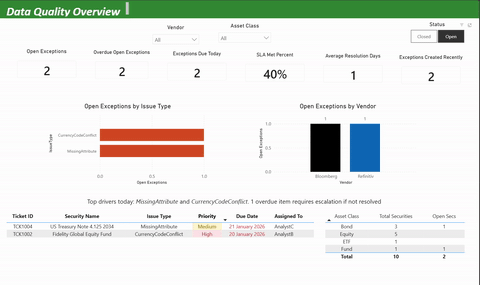

# Security Reference Data Mini Project

## Objective
I built a small security reference data pipeline that ingests Bloomberg style attributes, runs data quality checks, and consolidates them into a Security Master. I also added an exception queue with SLA tracking and a Power BI dashboard to monitor open issues, breaches, and daily investigation workload.

## Workflow and tasks

### Step 1 Sourcing
Getting the data from somewhere.
- External vendors like Bloomberg, Refinitive
- Internal sources like trading, accounting, or portfolio systems.

Key point: each source can disagree, arrive at different times, and use different identifiers

### Step 2 Analysis
Checking whether it makes sense and whether it matches expectations.

- Is the currency correct for a London listed share?
- Did a bond coupon change unexpectedly?
- Do we suddenly have two records for the same security?

Analysis here is investigation, validation, and understanding data patterns. 

### Step 3 Integration
Bringing multiple sources together into a consistent internal model.

- Mapping vendor identifiers to security IDs.
- Choosing which source is the golden value for each field.
- Applying transformation rules, like standardising exchange codes or country codes.

This is where vendor data is mapped, standardised, and merged into a single golden Security Master record.

### Step 4 Management
Ongoing maintenance of that data over time.

- Daily updates, fixes, overrides, corporate action processing.
- Handling new security setups.
- Controlling data quality rules and audit trails.
- Handling exceptions and keeping SLAs.

Data to day ongoing task.

### Step 5 Distribution
Delivering the cleaned and controlled data to everyone who needs it.
- Portfolio managers need it for trading and research.
- Risk and performance teams need it for analytics.
- Operations teams need it for settlements and reconciliations.
- Compliance needs it for restrictions and reporting.

Publishing to downstream databases, data marts, reports, feeds, or APIs.

## Case study

A new corporate bond is issued.

- Sourcing: Bloomberg feed delivers the bond reference record.
- Analysis: quality checks flag missing required attributes and an identifier mismatch.
- Integration: map ISIN to SecurityID and standardise key fields.
- Management: investigate the exception, document the fix, and complete within SLA.
- Distribution: publish the corrected record so downstream systems can use it for trading and reporting.

## Power BI dashboard

  

1. Data Quality Overview  
2. Exceptions and SLA  
3. Vendor Comparison  
4. Index and Portfolio Impact  

## Deliverables
1. Clean Security Master table  
2. Vendor comparison table  
3. Exception queue table with SLA measures  
4. Power BI report built on those tables  

## Repository structure

* data  
  * DimSecurityMaster.csv  
  * FactVendorSecuritySnapshot.csv  
  * FactExceptions.csv  
  * FactIndexConstituents.csv  
  * FactPortfolioHoldings.csv  
* docs  
  * ProjectTasks.md  
  * PowerBI_Measures_DAX.txt
    
* README.md  

## Future enhancements
1. Add a small data dictionary for each table and field  
2. Add automated validation rules and exception generation logic in SQL or Python  
3. Add a simple audit log that captures who changed what and when  
4. Add refresh scheduling and alerting based on SLA breach risk  

## Disclaimer
All data in this repository is synthetic and for demonstration purposes only.
